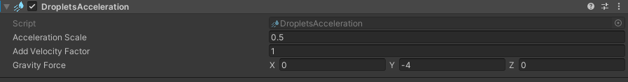

# Droplets Acceleration

## About
This component applies forces like acceleration and gravity to the simulated rain.

## Parameters
- `Acceleration Scale` - acceleration is multiplied by this value. You can controll this way how much acceleration should impact the rain movement.
- `Add Velocity Factor` - adds car velocity in addition to the acceleration to the force acting on the rain drops (i.e., when car is not accelerating but going with a set speed the drops will be still affected like in real life by the air drag).
- `Gravity Force` - vector of gravity acting on the rain drops. You can add wind vector to it to simulate windy weather. 

 

  <a href="#/WindshieldRain" class="prev">
    
Windshield Rain

    
⬅ Previous Page

  </a>
  <a href="#/Wipers" class="next">
    
Wipers

    
Next Page ➡

  </a>

