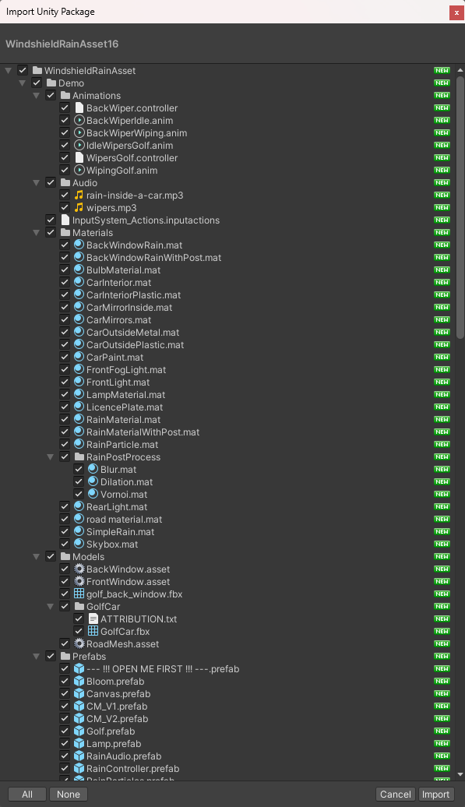
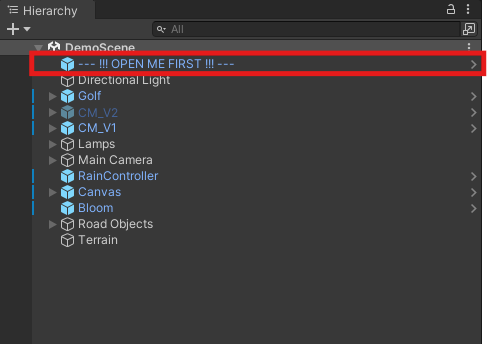
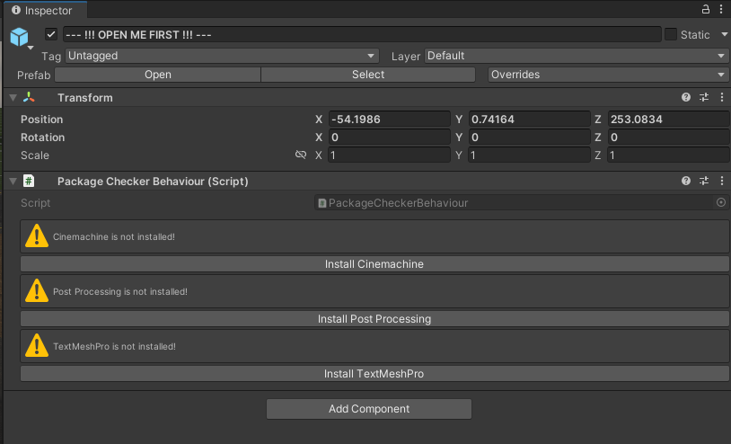
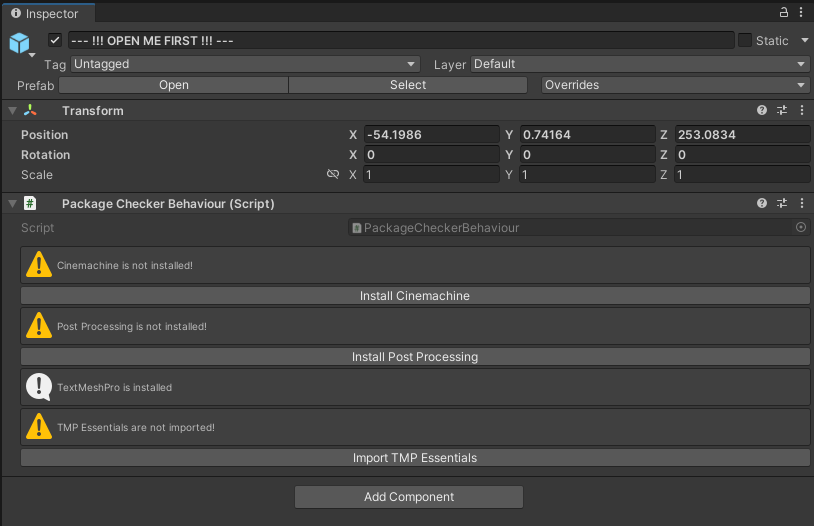
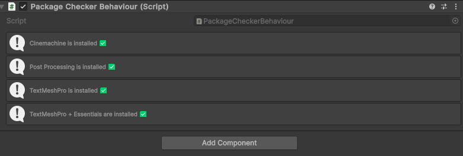
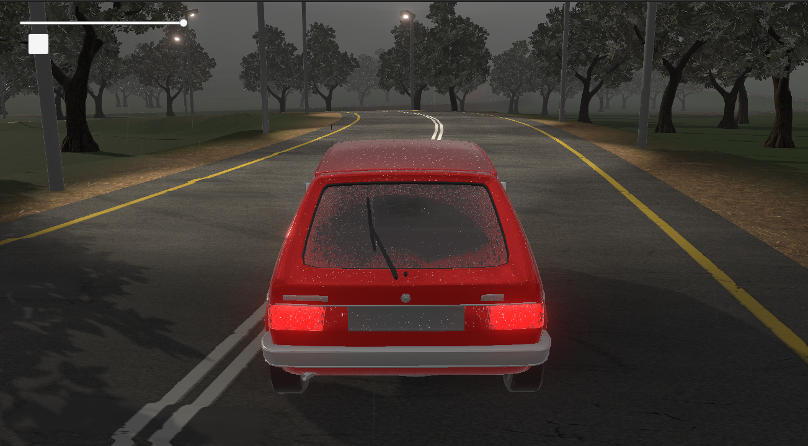
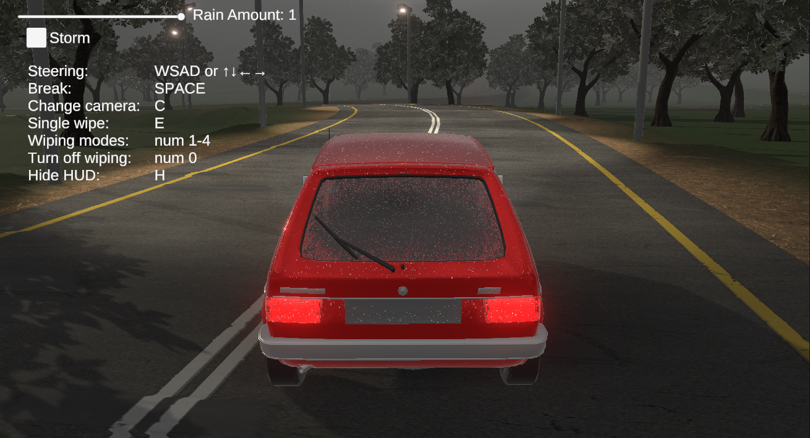

# Opening Demo Scene

Firstly import all elements from the asset package.

>  
> Importing asset

Then navigate to directory "Assets/WindshieldRainAsset/Demo/Scenes" and open "DemoScene" scene. 
Next before you run the scene click first on the GameObject named "--- !!! OPEN ME FIRST !!! ---" in the scene hierarchy.

> 
> First open this GameObject

In the Inspector you should see something like this:

>  
> You should see this component

If you have newer Unity Editor you will see that TextMeshPro is already installed because its now built into the Unity Editor.

>  
> In the newer Unity Editors TextMeshPro is already installed

Now install all missing packages by clicking on the buttons **one at a time!** This may take a while so you have to be patient. After installing all packages, the "PackageCheckerBehaviour" component should look like this:

>  
> After installing all packages you should see this

Now you can start the Demo Scene!

Sometimes when starting the scene just after you've installed TextMeshPro Essentials the UI text doesn't load.
If your text is missing like below, stop and restart the game one more time.

>  
> If you don't see UI text in your Demo Scene, stop and start the scene one more time.

Now everything should work. You can play around and test the Windshield Rain Asset!

>  
> Now you can enjoy the demo scene :D

    
    <a href="#/PrepareCar" class="next">
        
Prepare Your Car

        
Next Page ➡

    </a>

