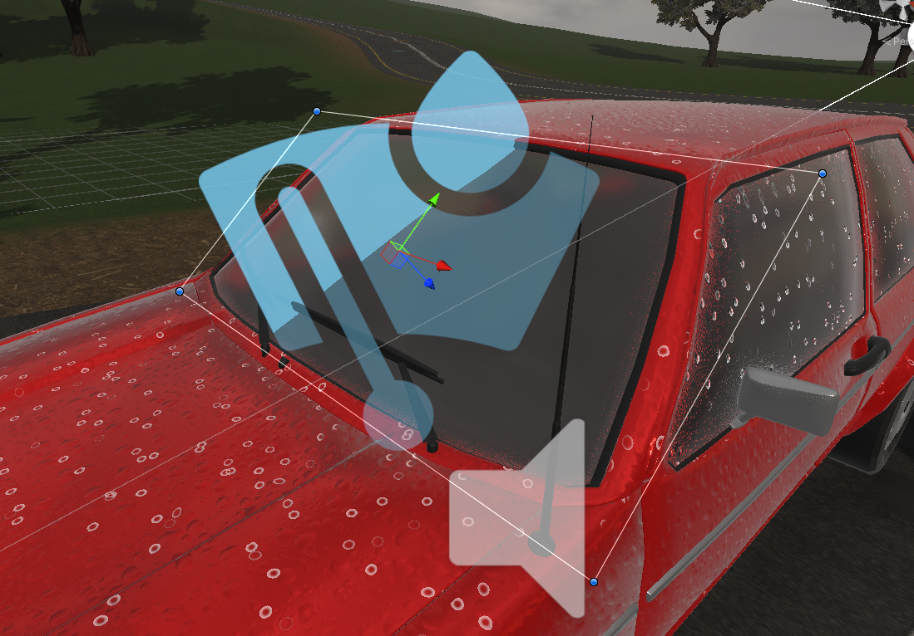
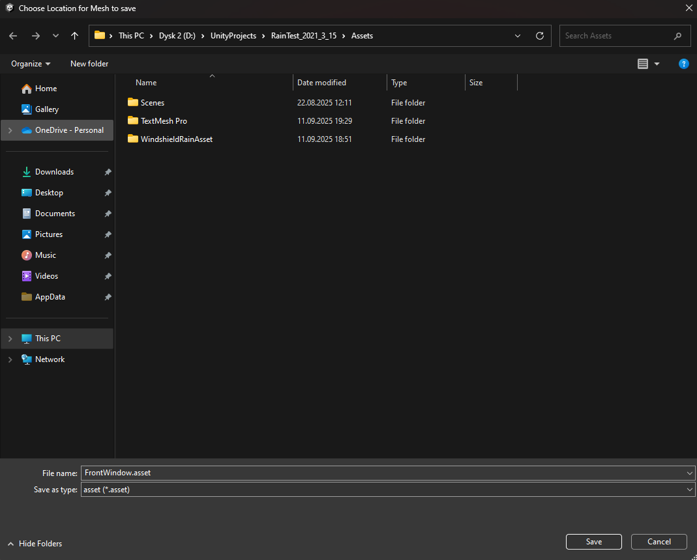

# Prepare Your Car

To add the rain effect to your car first you have to make sure that your windshield mesh is separate from rest of the car. If your windshield mesh is merged with other parts of the car you can use Blender to separate it.
Just enter the edit mode by pressing `Tab`, next select all vertices of your windshield, click `P` and choose `Selection`. Now your meshes have separated, you can export them to Fbx and import to Unity.

>  
> You can separate your windshield mesh using Blender

Now when you have car model prepared with your windshield mesh separated create a new empty GameObject near to your windshield.
Next add the [WindshieldRain](/WindshieldRain) component to it.

>  
> Add [WindshieldRain](/WindshieldRain) component to your empty GameObject

At the top of the component you should see warning to add [CommandBufferBlur](/CommandBufferBlur) to your main camera. Click `Add CommandBufferBlur to main camera` button for the warning to disappear and for blur texture to work properely for your windshield shader.

>  
> Add [CommandBufferBlur](/CommandBufferBlur) component to your main camera for the blur texture to work

You should see a rectangle on the scene view. If you don't see it make sure to enable Gizmos in the scene view. Now adjust the rectangle to fit the windshield as close as you can. You can use gizmos handles or `Width` and `Height` parameters under the `Windshield Plane Settings` in the [WindshieldRain](/WindshieldRain) component. It should look something like this.

>  
> Adjust windshield plane to fit your mesh

When the Windshield Plane is ready, place your windshield mesh filter in the `Windshield Mesh` field under the `Windshield Plane Settings`.
Then press `Recalculate Mesh UVs`. Now window should pop-up and you can select location where you will save the mesh with recalculated UVs.
After saving the mesh it will be automatically replaced in your **MeshFilter** component (your old mesh will still be in the project files if you didn't overrite it).

>  
> Save mesh with recalculated UVs

Now your windshield mesh is ready for the rain!

Go to the next page to learn how to setup [WindshieldRain](/WindshieldRain) component properties.

  <a href="#/OpenDemoScene" class="prev">
    
Open Demo Scene

    
⬅ Previous Page

  </a>
  <a href="#/WindshieldRain" class="next">
    
Windshield Rain

    
Next Page ➡

  </a>

