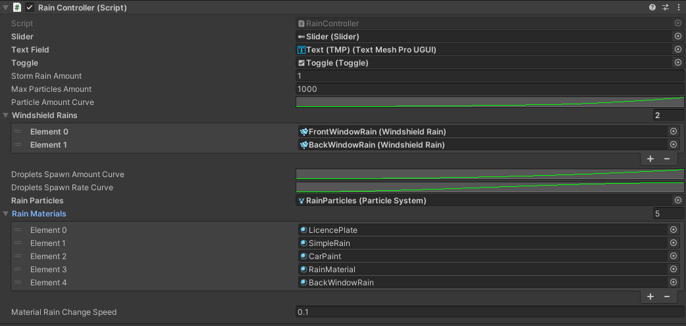

# Rain Controller

## About
This is a simple script that coordinates all rain components and makes it easy to adjust rain strength in the game. You can also use it as a base to create your own script for controlling the rain.

## Params

- `Slider` - UI slider object that will be used to set rain strength in the game.
- `Text Field` - UI Text Field used to display the rain strength in the game.
- `Toggle` - *storm* toggle to enable storm in the game.
- `Storm Rain Amount` - [rain spawn amount](/WindshieldRain#rain-drops-settings) when the *storm* is enabled.
- `Max Particles Amount` - max amount of particles in the rain particle system.
- `Windshield Rains` - array of the [Windshield Rain](/WindshieldRain) components used in the scene.
- `Droplets Spawn Amount Curve` - curve of the [rain spawn amount](/WindshieldRain#rain-drops-settings).
- `Droplets Spawn Rate Curve` - curve of the [rain spawn rate](/WindshieldRain#rain-drops-settings).
- `Rain Particles` - rain particle system.
- `Rain Materials` - array of rain materials used in the scene (both [Rain Materials](/RainMaterial) and [Simple Rain Materials](/SimpleRainMaterial)).
- `Material Rain Change Speed` - how fast the rain amount on the materials will be changed.

 

  <a href="#/SimpleRainMaterial" class="prev">
    
Simple Rain Material

    
⬅ Previous Page

  </a>
  <a href="#/RenderingWindshieldAndBlur" class="next">
    
Rendering Windshield And Blur

    
Next Page ➡

  </a>

