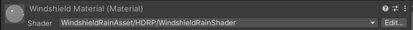

# Rain Material
For your windshield rain to work properely, create material with the `WindshieldRainAsset/<YourPipeline>/WindshieldRainShader` shader. Then assign it to your windshield **MeshRenderer**, `Rain Material` in [WindshieldRain](/WindshieldRain) component and `Material` in [Wipers](/Wipers) component. You can adjust material properties to your likings. Each parameter is described below.

 
 
 

## Assigned By Script
This parameters are assigned by the [WindshieldRain](/WindshieldRain) and [Wipers](/Wipers) scripts. It is recomended to not set them manually.
- `Rain Height Map` - height map of rain drops assigned by the [WindshieldRain](/WindshieldRain) script.
- `Wipers Texture` - wipers texture assigned by the [Wipers](/Wipers) script.

 

## Surface Settings
- `Cull Mode` - surface culling mode, possible options are `Front`, `Back` and `Off`. In the URP and HDRP pipeline this setting is in the `Surface Options` panel.
- `Color Texture` - optional texture to add some color to your windshield like dirt or some stickers.
- `Color Texture Color Multiplier` - multiplies `Color Texture` by the color value. You can controll also alpha value of the texture this way.
- `Color Texture Scale & Offset` - `x` and `y` values controll texture scale, `y` and `z` texture offset.
- `Metalic` - how much surface should be metallic.
- `Smoothness` - how much surface should be smooth.
- `Smoothness Map` - texture of surface smoothness, white by default.
- `Smoothness Map Scale & Offset` - `x` and `y` values controll texture scale, `y` and `z` texture offset.

 

## Rain Drops
- `Rain Normal Strength` - strength of rain normals.
- `Rain Normal Texel Size` - size of step to compute rain normal from height map.
- `Rain Height Threshold` - threshold where rain drop stop being a drop and starts being a trail.
- `Rain Distortion` - how much rain normals should distort the image.
- `Rain Smoothness` - how much smooth the rain drops should be.

 

## Rain Reflection
Rain reflection is an additional reflection added to the rims of the rain drops to simulate reflection of the sky.

- `Reflection Mask Threshold` - how much rain normal should deviate from the upward vector to reflect. This ensures the reflections appears only on the drops edges.
- `Reflection Color` - color of rain drops reflection.
- `Reflection Power` - reflection value is raised to this power. Practicaly the bigger the value the smaller is the reflection area.
- `Reflection Strenght` - strength of the reflection.

 

## Rain Background Blur
The backgroung blur is a normal map with additional blur to create the impression of fine static rain and light fog on the windshield.

- `Rain Background Strength` - strength of the rain background effect.
- `Rain Streak Impact` - controlls how much the rain streak impacts the rain background.
- `Rain Streak Threshold` - threshold when rain streak should end.
- `Rain Streak Blur Strength` - strength of rain streak blur.
- `Blur Color` - color of the rain background. Alpha controlls how strong the color is.
- `Blur Strength` - strength of the rain background blur.
- `Background Normal Strength` - strength of the rain background normal.
- `Background Normal Map` - normal map of the rain background. Simulates little static drops on the windshield.
- `Background Normal Scale & Offset` - `x` and `y` values controll texture scale, `y` and `z` texture offset.

 

## Rain Smudges
This controlls appearance of the wipers smudges.

- `Smudges Threshold` - threshold when smudges should disappear.
- `Smudges Blur Strength` - how much smudges should blur the image behind.
- `Smudges Color` - color of the smudges. Alpha controlls the strength of the color.
- `Smudge Smoothness` - how smooth should be the surface where smudges appear.

 

  <a href="#/Wipers" class="prev">
    
Wipers

    
⬅ Previous Page

  </a>
  <a href="#/WindshieldMeshRenderer" class="next">
    
Windshield Mesh Renderer

    
Next Page ➡

  </a>

