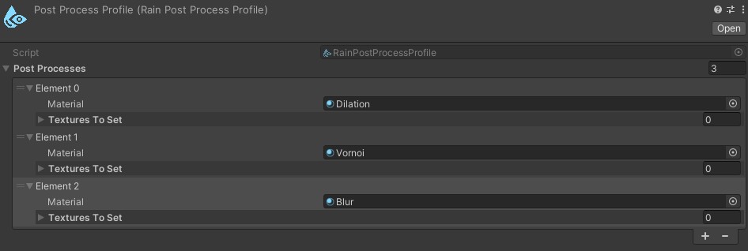
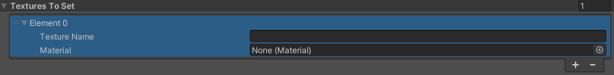
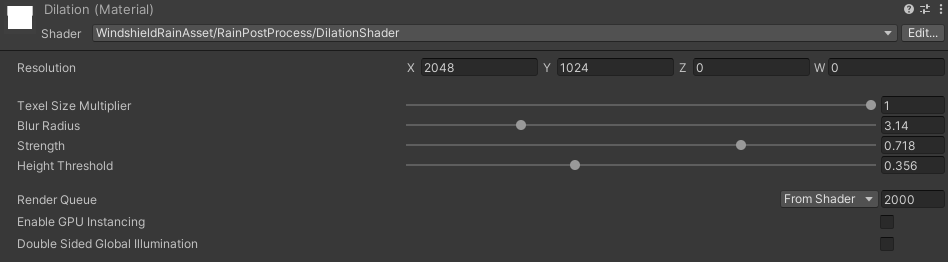
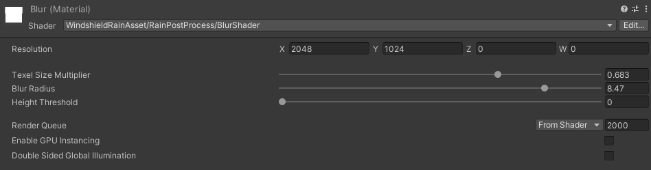
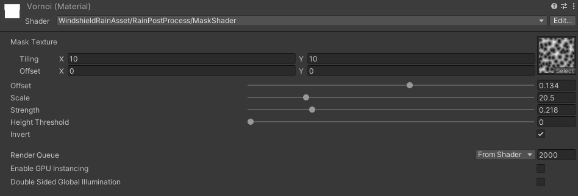

# Rain Post Process Profile

To further process the rain texture before sending it to the rain material you can apply post processing to it. To do this you can create **RainPostProcessProfile** by clicking right mouse button on the Project tab and selecting `Create > WindshieldRain > RainPostProcessProfile`. There you can specify post process stack which will be applied to your rain texture.

 
**RainPostProcessProfile** contains array of PostProcess objects.
Each contains:
  - `Material` - [post process material](#rain-post-process-material)
  - `Textures To Set` - array of optional elements where you can set resulting texture to other textures in materials. Each element has parameters:
    - `Texture Name` - target texture name
    - `Material` - target material 
     

## Rain Post Process Material
Each post process is based on a material with shader that applies some changes to texture. For it to work the shader has to have `_MainTex` texture as the input texture. It should leave the alpha value of the rain texture unchanged.

### Example Post Process Shaders
I've prepared for you three example shaders that are implementing those rules and can be used as a post processing materials.

#### Dilation
This post process shader you can find in the `WindshieldRainAsset/RainPostProcess/DilationShader`. It dilates droplets making them appear bigger and connect with nearby drops.
It has following parameters:

- `Resolution` - texture resolution
- `Texel Size Multiplier` - how big should the texel size be
- `Blur Radius` - how much neighbour pixels should affect the current pixel.
- `Strength` - strength of the effect.
- `Height Threshold` - threshold of the effect (to not affect the rain trails).

 

#### Blur
This post process shader you can find in the `WindshieldRainAsset/RainPostProcess/BlurShader`. It blurs droplets height map making it smoother.
It has following parameters:

- `Resolution` - texture resolution
- `Texel Size Multiplier` - how big should the texel size be
- `Blur Radius` - how much neighbour pixels should affect the current pixel.
- `Height Threshold` - threshold of the effect (to not affect the rain trails).

 

#### Mask
This post process shader you can find in the `WindshieldRainAsset/RainPostProcess/MaskShader`. It applies mask on the rain height map. Below in the example is shown vornoi noise as the mask.
It has following parameters:

- `Mask Texture` - mask texture with tiling and offset
- `Offset` - height offset of the mask texture
- `Scale` - height scale of the mask texture
- `Strength` - strength of the mask effect
- `Height Threshold` - threshold of the effect (to not affect the rain trails).
- `Invert` - if true it inverts mask values.

 

  <a href="#/RainMaterial" class="prev">
    
Rain Material

    
⬅ Previous Page

  </a>
  <a href="#/SimpleRainManager" class="next">
    
Simple Rain Manager

    
Next Page ➡

  </a>

