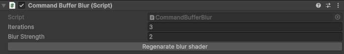
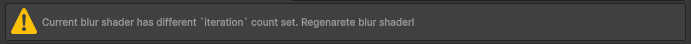
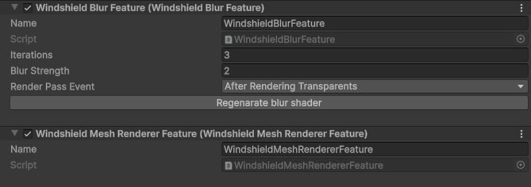
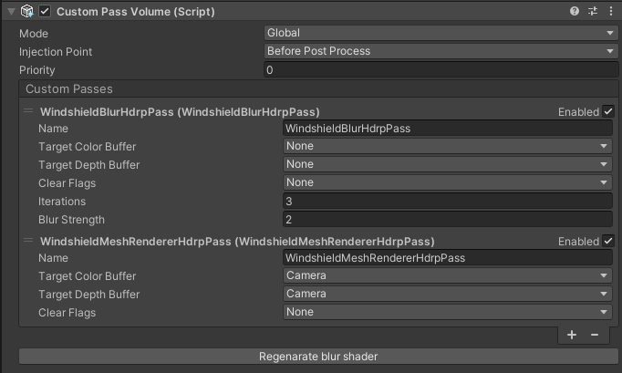

# Rendering Windshield Meshes and Blur Textures

## Built-in - Command Buffer Blur

This script creates command buffer and applies it to the main camera to create Blur textures for the rain shaders to work properely. 
You can attach this to your main camera by clicking `Add CommandBufferBlur to main camera` button in your [Windshield Rain](/WindshieldRain) component.

It is based on the MIT licensed project: https://github.com/andydbc/unity-frosted-glass/tree/master.

>  
> **Command Buffer Blur** component

### Params
- `Iterations` - (1-7 iterations) number of blur iteration. The more iterations the stronger blur can get but is more performance demanding. It cannot be changed in the runtime. After changing it you have to regenerate blur shader by clicking "Regenerate blur shader" button below. A warning reminding to regenarate blur shader should also appear.
       
- `Blur Strength` - pixel offset that controlls blur strength. The greater the more blurred image is, but after some value image artifacts start to appear.
- `Regenerate blur shader` - button that regenerates blur shader. It is important to click it after changing blur iterations count.

## URP - Renderer Features
In the URP pipeline we are using custom render features **Windshield Blur Feature** to render blur textures and **Windshield Mesh Renderer Feature** to render windows meshes. They should be in this order in the Universal Renderer Data asset.

>  
> Windshield custom render features 

### Windshield Blur Feature
- `Iterations` - (1-7 iterations) number of blur iteration. The more iterations the stronger blur can get but is more performance demanding. It cannot be changed in the runtime. After changing it you have to regenerate blur shader by clicking "Regenerate blur shader" button below. A warning reminding to regenarate blur shader should also appear.
       
- `Blur Strength` - pixel offset that controlls blur strength. The greater the more blurred image is, but after some value image artifacts start to appear.
- `Render Pass Event` - determines when the blur textures will be rendered it is recommended to leave this at value `After Rendering Transparents`
- `Regenerate blur shader` - button that regenerates blur shader. It is important to click it after changing blur iterations count.

### Windshield Mesh Renderer Feature
Renders all [Windshield Mesh Renderers](/WindshieldMeshRenderer) after the windshield blur feature pass.

## HDRP - Custom Pass Volume
In the HDRP pipeline we are using Cutom Passes in the **Custom Pass Volume** to render blur and windows meshes. **Windshield Blur HDRP Pass** to render blur textures and **Winshield Mesh Renderer HDRP Pass** to render [Windshield Mesh Renderers](/WindshieldMeshRenderer). It is important that they are in this order.

>  
> Windshield custom HDRP passes

### Params
- `Mode` - should be set to `Global`
- `Injection Point` - should be set to `Before Post Process`

### Windshield Blur HDRP Pass
- `Target Color Buffer` - should be left at `None`
- `Target Depth Buffer` - should be left at `None`
- `Clear Flags` - should be left at `None`
- `Iterations` - (1-7 iterations) number of blur iteration. The more iterations the stronger blur can get but is more performance demanding. It cannot be changed in the runtime. After changing it you have to regenerate blur shader by clicking "Regenerate blur shader" button below. A warning reminding to regenarate blur shader should also appear.
       
- `Blur Strength` - pixel offset that controlls blur strength. The greater the more blurred image is, but after some value image artifacts start to appear.
- `Regenerate blur shader` - button that regenerates blur shader. It is important to click it after changing blur iterations count.

### Winshield Mesh Renderer HDRP Pass
Renders all [Windshield Mesh Renderers](/WindshieldMeshRenderer) after the windshield blur pass.
- `Target Color Buffer` - should be left at `Camera`
- `Target Depth Buffer` - should be left at `Camera`
- `Clear Flags` - should be left at `None`

  <a href="#/RainController" class="prev">
    
Rain Controller

    
⬅ Previous Page

  </a>
  <a href="#/Troubleshooting" class="next">
    
Troubleshooting

    
Next Page ➡

  </a>

