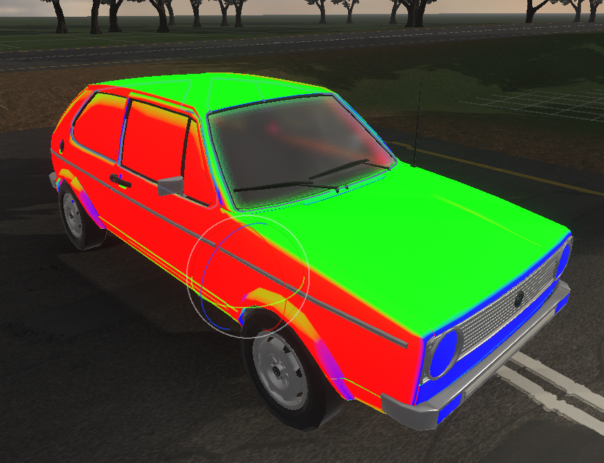

# Simple Rain Manager

## About
This component controlls [simple rain shader](/SimpleRainMaterial) physics. This shader is a triplanar shader with simple rain effect. To make it look like rain is reacting to the car acceleration, we create 4 layers of rain and each layer plays rain animation in the direction opposite to the car acceleration in the constant time intervals.

## Params

- `Add Velocity Factor` - adds car velocity in addition to the acceleration to the force acting on the rain drops (i.e., when car is not accelerating but going with a set speed the drops will be still affected like in real life by the air drag).
- `Acceleration Scale` - acceleration is multiplied by this value. You can controll this way how much acceleration should impact the rain movement.
- `Gravity Vector` - vector of gravity acting on the rain drops. You can add wind vector to it to simulate windy weather.
- `Time Mod` - there are 4 layers of rain played one after another this time specifies how long (in seconds) one layer animation plays. So if `Time Mod` is 4 each animation is played every second and lasts 4 seconds.
- `Rain Materials` - list of [Simple Rain Materials](/SimpleRainMaterial) to which the rain direction vector will be applied.
- `Set Acceleration Forcibly` - if true the acceleration vector won't be calculated, instead it will be set from the `Forced Acceleration` vector param.
  - `Forced Acceleration` - world space vector applied directly to the shader as a rain direction.
- `Triplanar Faces Rotation` - rotation of the triplanar shader planes relative to the current gameObject transform.
- `Debug Material` - if `true` the material should display RGB colors of each triplanar plane. 
  
- `Show Debug Gizmos` - if `true` will show gizmos representing triplanar planes.
  - `Gizmo Scale` - scale of gizmo rectangles.
  - `Gizmo Distance` - distance of the gizmo rectangles from the center of gameObject. 
   

  <a href="#/RainPostProcess" class="prev">
    
Rain Post Process Profile

    
⬅ Previous Page

  </a>
  <a href="#/SimpleRainMaterial" class="next">
    
Simple Rain Material

    
Next Page ➡

  </a>

