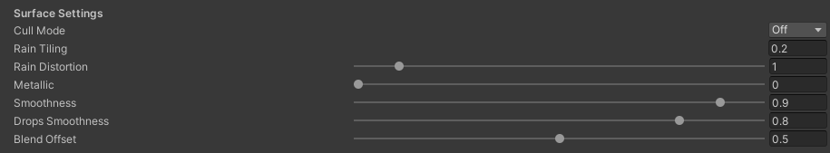

# Simple Rain Material
This is shader that is simpler than this in the [Windshield Rain](/WindshieldRain), but it is more performant and is a great choice for imitating simple rain physics on the car body and car side windows.
It uses triplanar shading with a simple rain effect. To make it look like rain is reacting to the car acceleration, we create 4 layers of rain and each layer plays rain animation in the direction opposite to the car acceleration in the constant time intervals. I created two variants of this shader for [glass like objects](#glass-material) and for [opaque objects](#standard-material).

## Glass Material
This shader you can find in shader path `WindshieldRainAsset/SimpleRainGlass`. It imitates rain on glass material.

 

It has following parameters you can tweak:

### Surface Settings
- `Cull Mode` - culling mode, you can choose one of this options: `Front`, `Back` and `Off`.
- `Rain Tiling` - scale of rain drops
- `Rain Distortion` - strength of how much rain normals will distort the image.
- `Metallic` - surface metallic strength.
- `Smoothness` - surface smoothness.
- `Drops Smoothness` - smoothness of drops surface.
- `Blend Offset` - offset of triplanar blending.

 

### Static Rain
- `Enable Static Rain` - if enabled small procedural static drops will be rendered (it makes a slight performence overhead).
- `Static Rain Scale` - scale of static rain drops.
- `Static Rain Time Speed` - static rain drops appearing and disappearing rate.

 

### Rain Settings
- `Rain Amount` - amount of rain
- `Rain Normal Strength` - strength of rain normal vectors
- `Rain Trial Length` - length of rain drops trials.
- `Rain Trial Strength` - strength of rain drops trials.
- `Rain Trial Slope` - length of rain drops trail slope.
- `Rain Appearing Speed` - how fast drops are appearing and disappearing.
- `Rain Appearing Slope` - how smooth are drops appearing and disappearing.

 

### Rain Background Blur
- `Trial Blur Reduction` - how much drop trial reduces rain background blur.
- `Background Strength` - strength of the rain background.
- `Blur Strength` - strength of the rain background blur.
- `Background Color` - color of the rain background.
- `Background Normal Strength` - strength of the rain background normal vectors.
- `Background Normal Map` - normal map of the rain background.

 

### Rain Reflection
- `Reflection Mask Threshold` - threshold of the reflection mask.
- `Reflection Mask Slope` - slope of the reflection mask.
- `Reflection Color` - color of the rain drops reflection.
- `Reflection Power` - reflection value is raised to this power. Practicaly the bigger the value the smaller is the reflection area.
- `Max Reflection Strength` - max strength of the reflection.
- `Reflection Strength` - strength of the reflection.
- `Reflection Normal Strength` - strength of normal vectors used to calculate the reflection.

 

### Debug
- `Debug` - if `true` it will display RGB values of the triplanar planes.

 

## Standard Material
This shader you can find in shader path `WindshieldRainAsset/SimpleRainStandard`. It imitates rain on opaque material.

 

### Surface Settings
- `Cull Mode` - culling mode, you can choose one of this options: `Front`, `Back` and `Off`.
- `Main Texture` - main texture of the surface.
- `Color` - color of the surface (`Main Texture` color is multiplied by this value).
- `Rain Tiling` - scale of rain drops
- `Rain Distortion` - strength of how much rain normals will distort the image.
- `Metallic` - surface metallic strength.
- `Wet Smoothness` - surface smoothness when it is wet.
- `Dry Smoothness` - surface smoothness when it is dry.
- `Drops Smoothness` - smoothness of drops surface.
- `Blend Offset` - offset of triplanar blending.

 

### Static Rain
- `Enable Static Rain` - if enabled small procedural static drops will be rendered (it makes a slight performence overhead).
- `Static Rain Scale` - scale of static rain drops.
- `Static Rain Time Speed` - static rain drops appearing and disappearing rate.

 

### Wetness
- `Wetness Mask` - texture that specifies which parts of the mesh can be wet and have rain.

 

### Rain Settings
- `Rain Amount` - amount of rain
- `Rain Normal Strength` - strength of rain normal vectors
- `Rain Trial Length` - length of rain drops trials.
- `Rain Trial Strength` - strength of rain drops trials.
- `Rain Trial Slope` - length of rain drops trail slope.
- `Rain Appearing Speed` - how fast drops are appearing and disappearing.
- `Rain Appearing Slope` - how smooth are drops appearing and disappearing.
- `Drop Smoothness Multiplier` - multiplies drops smoothness value by this parameter.
- `Trail Smoothness Multiplier` - multiplies drops trail smoothness value by this parameter.

 

### Rain Detail
- `Detail Rain Normal Strength` - strength of rain detail normal vectors.
- `Detail Rain Normal Map` - normal map of rain detail.

 

### Rain Reflection
- `Reflection Mask Threshold` - threshold of the reflection mask.
- `Reflection Mask Slope` - slope of the reflection mask.
- `Reflection Color` - color of the rain drops reflection.
- `Reflection Power` - reflection value is raised to this power. Practicaly the bigger the value the smaller is the reflection area.
- `Max Reflection Strength` - max strength of the reflection.
- `Reflection Strength` - strength of the reflection.
- `Reflection Normal Strength` - strength of normal vectors used to calculate the reflection.

 

### Debug
- `Debug` - if `true` it will display RGB values of the triplanar planes.

 

  <a href="#/SimpleRainManager" class="prev">
    
Simple Rain Manager

    
⬅ Previous Page

  </a>
  <a href="#/RainController" class="next">
    
Rain Controller

    
Next Page ➡

  </a>

