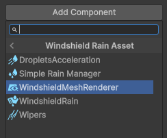
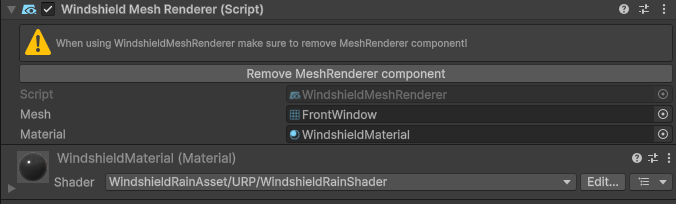

# Windshield Mesh Renderer

This component makes sure that your car windows meshes are rendered after the Windshield Blur Textures Pass. It is used only in the URP and HDRP pipelines. This makes rendering transparent objects like rain drops and other behind the windshield possible.

To replace your **MeshRenderer** component just add **WindshieldMeshRenderer** compoenent to your object.
>  
> Add **WindshieldMeshRenderer** component to your car window object.

Then mesh and material will be automatically assigned and you should see warning to remove **MeshRenderer**. Click "Remove Mesh Renderer component" button and its done.

>  
> Click "Remove Mesh Renderer component" button to remove **MeshRenderer**.

  <a href="#/RainMaterial" class="prev">
    
Rain Material

    
⬅ Previous Page

  </a>
  <a href="#/RainPostProcess" class="next">
    
Rain Post Process Profile

    
Next Page ➡

  </a>

