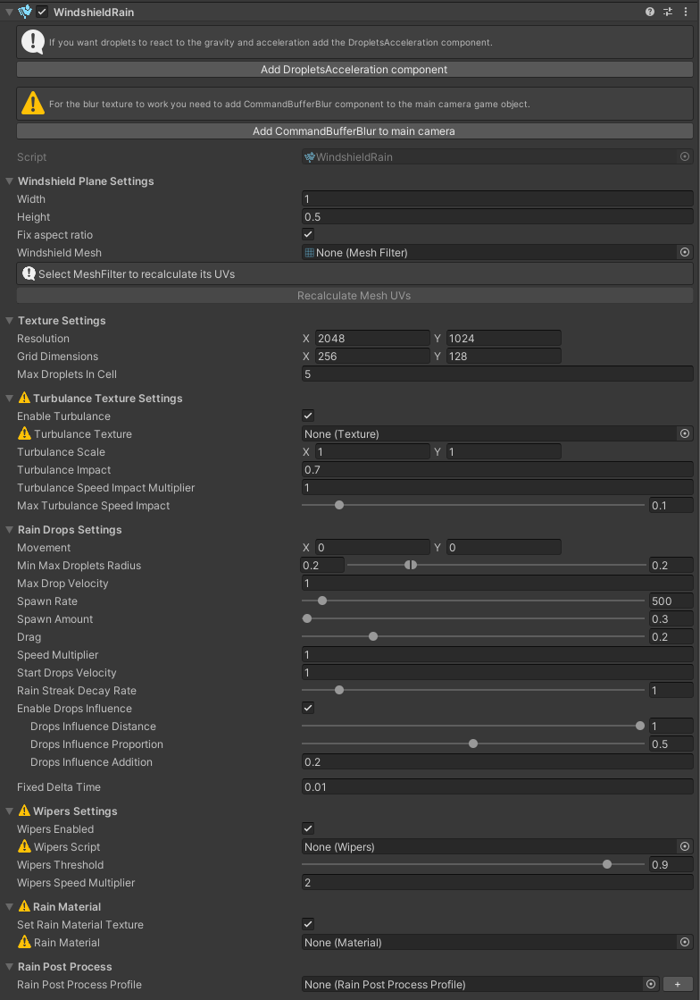
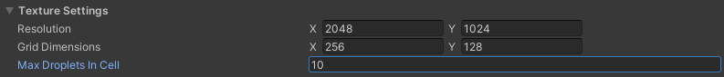

# Windshield Rain

**WindshieldRain** component simulates rain drops on your windshield using ComputeShader. You can configure here how your rain drops should look and behave. When you add **WindshieldRain** component to your gameObject it should look like this:

>  
> Empty **WindshieldRain** component

At the top of the component you can see warning. It is here to make sure your windshield blur and [WindshieldMeshRenderers](/WindshieldMeshRenderer) work correctly. They will vary depending on the render pipeline you are using:
 - Built-in - warning to add [CommandBufferBlur](/RenderingWindshieldAndBlur#built-in-command-buffer-blur) to your main camera.  Click `Add CommandBufferBlur to main camera` button for the warning to disappear.
   
 - URP - warning to add [Windshield Render Features](/RenderingWindshieldAndBlur#urp-renderer-features). Click `Add Render Features` button for the warning to disappear.
   
 - HDRP - warning to add [CustomPassVolume](/RenderingWindshieldAndBlur#hdrp-custom-pass-volume) with Windshield Passes. Click `Add Render Features` button for the warning to disappear.
   

If you are using URP or HDRP pipeline you can also see warning to use [WindshieldMeshRenderer](/WindshieldMeshRenderer) instead of **MeshRenderer** compoenents on your car windows.
>  
> Replace all your **MeshRenderer** components on your car windows with the [WindshieldMeshRenderer](/WindshieldMeshRenderer) component.

At the top of the **WindshieldRain** component you should see info box to add [DropletsAcceleration](/DropletsAcceleration) component to make your trops react to car acceleration and gravity. When you click `Add DropletsAcceleration component` button the component will be added automatically to your gameObject. You can read more about this component [here](/DropletsAcceleration).

>  
> Add [DropletsAcceleration](/DropletsAcceleration) component to your gameObject

> [!WARNING]
> When changing any value in the **WindshieldRain** component by script remember to call the `UpdateShaderValues()` method to apply changed parameters to the shaders!

## Windshield Plane
In this first section you can configure properties of your windshield plane. It is rectangle where your drops will be simulated and projected onto your mesh. For the rain texture to be properely projected onto your windshield mesh you need to adjust the windshield plane rectangle to fit your mesh and then recalculate mesh UVs as shown on the [Prepare Car](/PrepareCar) page.
You can set here following parameters:

- `Width` - width of the windshield plane
- `Height` - height of the windshield plane
- `Fix aspect ratio` - if checked the aspect ratio of the windshield plane will be fixed to the aspect ratio of the rain texture resolution.
- `Windshield Mesh` - **MeshFilter** which mesh UVs will be adjusted when clicking the `Recalculate Mesh UVs` button below.
- `Recalculate Mesh UVs` - when clicked it adjusts mesh UVs to be aligned to the windshield plane (as a result it should look like the rain texture is projected from the windshield plane onto the mesh) and saves resulting mesh in the specified location.

 

## Texture Settings
Here you can adjust properties of the rain texture.

- `Resolution` - rain texture resolution
- `Grid Dimensions` - rain texture is split into grid where in each cell drops physics is handled parallelly. This parameter specifies number of cells in width and height on the grid. 
- `Max Droplets In Cell` - max number of rain drops in the grid cell.

 

## Rain Turbulance
You can enable rain turbulance to simulate more chaotic movement of the rain drops.

- `Enable Turbulance` - if true it will enable the rain turbulance and reveal the rest of options. If false it will hide the rest of turbulance options.
- `Turbulance Texture` - **required** if turbulance is enabled. Texture of turbulance where `red` channel is the `x` value of turbulance vector, `green` channel is `y` value of turbulance vector and `blue` channel is speed multiplier.
- `Turbulance Scale` - scale of the turbulance texture.
- `Turbulance Impact` - strength of the turbulance vector (`red` and `green` channel).
- `Turbulance Speed Impact Multiplier` - strength of the turbulance speed multiplier (`blue` channel).
- `Max Turbulance Speed Impact` - maximum speed multiplier (speed will be multiplied every frame by the value in range from `1 - [Max Turbulance Speed Impact]` to `1 + [Max Turbulance Speed Impact]`).

 

## Rain Drops Settings
Here you can specify your rain drops look and behaviour.

- `Movement` - vector of the force acting on the rain drops. It can be set automatically by the [DropletsAcceleration](/DropletsAcceleration) component.
- `Min Max Droplets Radius` - range of rain drops radius.
- `Max Drop Velocity` - maximum velocity of the rain drop.
- `Spawn Rate` - controls how frequently drops are spawned.
- `Spawn Amount` - controls how much drops is spawned at a time.
- `Drag` - surface drag/friction which causes drops to slow down.
- `Speed Multiplier` - when calculating movement it multiplies velocity by this value, not affecting velocity vector itself.
- `Start Drops Velocity` - when drop is spawned its velocity vector is multiplied by this value.
- `Rain Streak Decay Rate` - specifies how fast the trail of the raindrop should decay.
- `Enable Drops Influence` - if enabled the neighbouring rain drops will be affecting each other.
  - `Drops Influence Distance` - distance of the neighbouring rain drops that will affect each other.
  - `Drops Influence Proportion` - how much rain drop velocity will be affected by the nearby droplets.
  - `Drops Influence Addition` - how much rain drops should reduce each others drag (the more drops the less drag).
- `Fixed Delta Time` - specifies how frequently rain texture should be updated by the compute shader (if frame rate will drop the real delta time will be greater, it acts like minimum delta time).

 

## Wipers Settings
Here you can adjust wipers settings:
- `Wipers Enabled` - if true the shader will calculate rain-wipers interactions.
- `Wipers Script` - [Wipers](/Wipers) component for your windshield. **Mandatory** if wipers are enabled.
- `Wipers Threshold` - threshold how long drops are affected by the wiper and not rendered under it.
- `Wipers Speed Multiplier` - velocity of drops under the wiper will be multipied by this value.

 

## Rain Material
Here you can set material for your rain:
- `Set Rain Material Texture` - if true it will set rain texture to the `_HeightMap` texture of given material.
- `Rain Material` - material to which rain texture will be applied. It is recommended to use material that uses `WindshieldRainAsset/WindshieldRainShader` shader. You can read more about it [here](/RainMaterial).

 

## Rain Post Prcess
Optionally you can use post process profile to apply some post processing on the rain texture. More on this you can read on the page about [Rain Post Process Profile](/RainPostProcess).

 

  <a href="#/PrepareCar" class="prev">
    
Prepare Your Car

    
⬅ Previous Page

  </a>
  <a href="#/DropletsAcceleration" class="next">
    
Droplets Acceleration

    
Next Page ➡

  </a>

