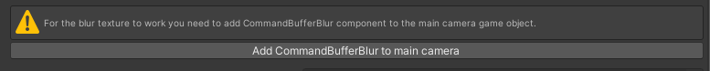

# Windshield Rain

**WindshieldRain** component simulates rain drops on your windshield using ComputeShader. You can configure here how your rain drops should look and behave. When you add **WindshieldRain** component to your gameObject it should look like this:

>  
> Empty **WindshieldRain** component

If you see warning to add [CommandBufferBlur](/CommandBufferBlur) to your main camera, click `Add CommandBufferBlur to main camera` button for the warning to disappear and for the blur texture to work properely for your windshield shader.

>  
> Add [CommandBufferBlur](/CommandBufferBlur) component to your main camera for the blur texture to work

At the top of the **WindshieldRain** component you should see info box to add [DropletsAcceleration](/DropletsAcceleration) component to make your trops react to car acceleration and gravity. When you click `Add DropletsAcceleration component` button the component will be added automatically to your gameObject. You can read more about this component [here](/DropletsAcceleration).

>  
> Add [DropletsAcceleration](/DropletsAcceleration) component to your gameObject

## Windshield Plane

## Texture Settings

## Rain Turbulance

## Rain Drops Settings

## Wipers Settings

## Rain Material

## Rain Post Prcess

  <a href="#/PrepareCar" class="prev">
    
Prepare Your Car

    
⬅ Previous Page

  </a>
  <a href="#/DropletsAcceleration" class="next">
    
Droplets Acceleration

    
Next Page ➡

  </a>

