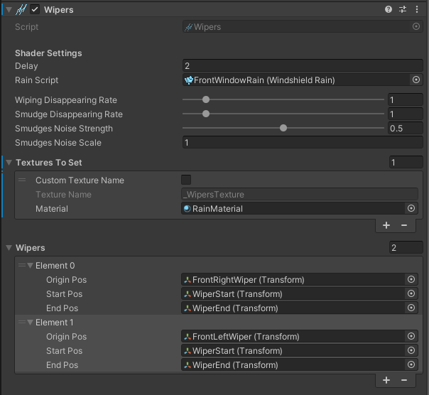

# Wipers

## About
In this component you can configure wipers for your windshield.

## Params

- `Delay` - specifies how many frames wipers needs to calculate movement vector for rain drops beneath them.
- `Rain Script` - [Windshield Rain](/WindshieldRain) component for your windshield.
- `Wiping Disappearing Rate` - determines how fast wiping effect (clear window) will disappear.
- `Smudge Disappearing Rate` - determines how fast wiping smudges will disappear.
- `Smudges Noise Strength` - controls how much noise (sine like) should have impact on the smudges appearance.
- `Smudges Noise Scale` - controls noise frequency (sine like).

- `Textures To Set` - array of materials with texture names to which the wipers texture will be assigned. This objects contain parameters:
  - `Custom Texture Name` - enable this to set custom `Texture Name` other than `_WipersTexture`.
  - `Texture Name` - name of the texture to which the wipers texture will be assigned. By default it is set to `_WipersTexture`.
  - `Material` - your rain material. It is recommended to use material described in [this](/RainMaterial) page. Usually it should be the same material you set to `Rain Material` in the [Windshield Rain](/WindshieldRain) component.

- `Wipers` - array of wipers objects. Wiper objects contains following parameters:
  - `Origin Pos` - transform of the wiper origin (pivot/rotation point).
  - `Start Pos` - transform of the beginning of the wiper blade.
  - `End Pos` - transform of the end of the wiper blade.

 

  <a href="#/DropletsAcceleration" class="prev">
    
Droplets Acceleration

    
⬅ Previous Page

  </a>
  <a href="#/RainMaterial" class="next">
    
Rain Material

    
Next Page ➡

  </a>

